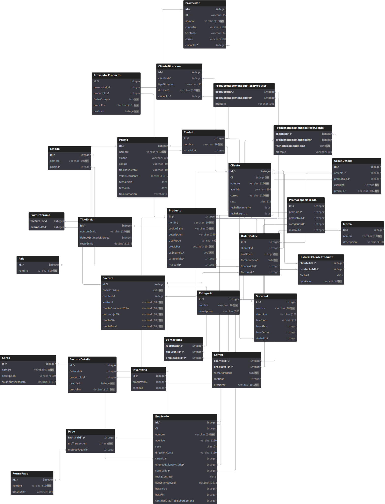
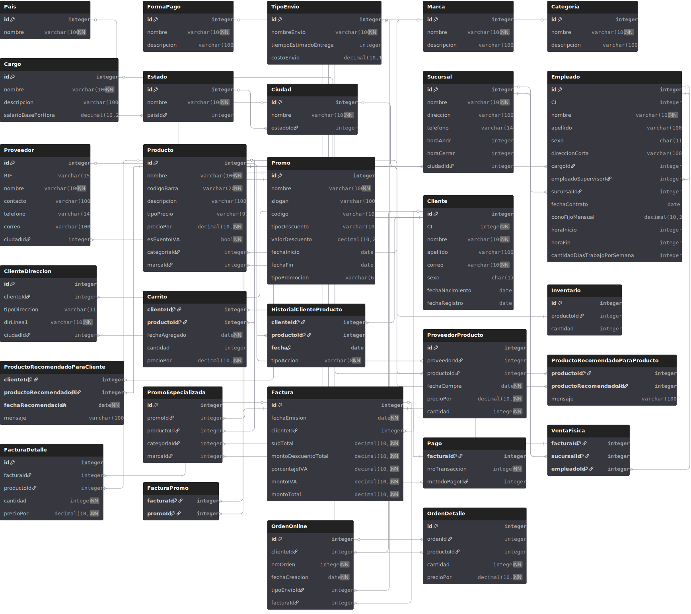
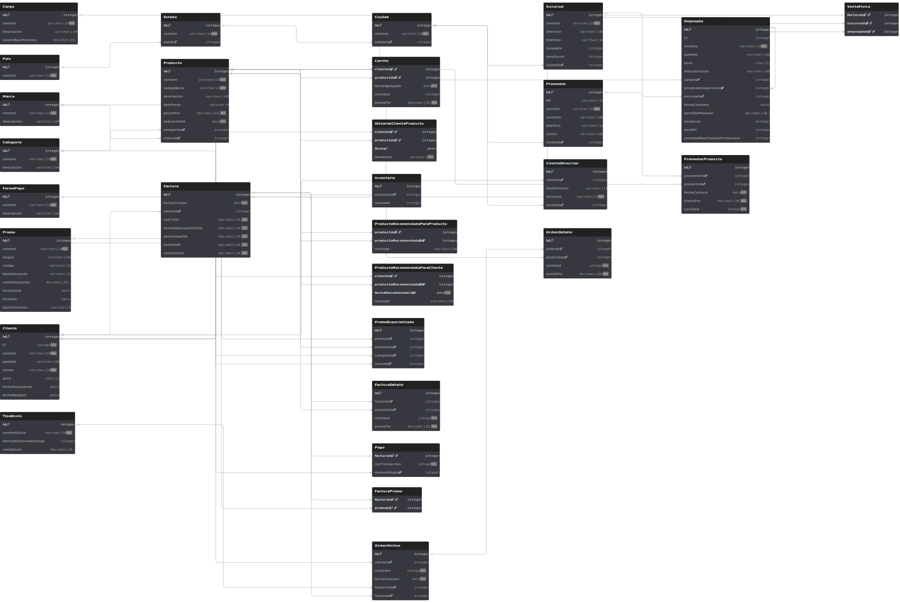

# Grocerlytics
This project is a comprehensive case study in database design and implementation for 'Grocerlytics', a fictional supermarket chain. The system manages both physical and online sales operations, handling customers, products, inventory, and promotions through advanced SQL programming, including stored procedures, functions, and triggers.
# Grocerlytics - Integrated Database System
## About
This project is a PostgreSQL database developed for a fictional supermarket. The system architecture and requirements are based on a university project from the Databases course at the Universidad Central de Venezuela. This system is designed to handle both **online** and **physical** sale operations. 
## Key Features
- A comprehensive relational model with over 25+ tables managing inventory, sales, customers, products, etc.
- Advanced analytical queries to generate complex business reports.
- Robust business logic implemented through **Stored Procedures** to simulate online transactions like online checkouts and supplier purchases.
- Automated data integrity and processes using **Triggers**, such as inventory updates upon sales and data validation for purchases.
- Custom **Functions** for reusable and precise financial calculations within the database.
## Database Schema
### Snowflake visual

### Compact

### Left to Right

### PDF of each diagram
[Snowflake visual](pdfs/grocerlyticsDB_Snowflake.pdf)
[Compact visual](pdfs/grocerlyticsDB_compact.pdf)
[Left to Right visual](pdfs/grocerlyticsDB_LefttoRight.pdf)
## Project Structure 
The project follows a script-based structure to ensure sequential execution: 
 1. 01_schema.sql - *Database and table creation*
 2. 02_inserts.sql - *Data population*
 3. 03_queries.sql - *Analytical queries*
 4. 04_functions.sql - *Custom functions*
 5. 05_procedures.sql - *Stored procedures*
 6. 06_triggers.sql - *Triggers*
## Tech Stack
- **Database**: PostgreSQL
- **Language**: SQL, PL/pgSQL
- **Tools**: Git, GitHub, PgAdmin and postgreSQL CLI
## Setup and Installation
- `git clone git@github.com:lopezolidev/Grocerlytics.git`
- Setup PostgreSQL database and user (either through CLI or PgAdmin)
- Configure the connection in a `.env` file (this file is ignored by Git).
- Run the SQL scripts in the correct order (`01_schema.sql`, then `02_inserts.sql`, etc.) to create and populate the database.
## Authors
- @lopezolidev (myself)
